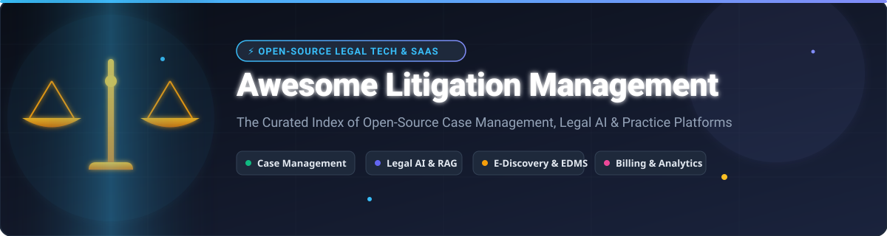

# ⚖️ Awesome Litigation Management & Legal Tech Ecosystem



<a href="https://github.com/ishandutta2007/Awesome-Awesome-Awesome"></a><a href="https://discord.gg/jc4xtF58Ve"></a> <a href="https://github.com/ishandutta2007/Awesome-Awesome-Awesome"></a> [](LICENSE) [](https://github.com/ishandutta2007/Awesome-Litigation-Management/pulls) <a href="https://github.com/ishandutta2007"></a>

> A comprehensive curated index of **litigation management platforms, legal case management software, law-firm practice management systems, legal matter management platforms, open-source legal technology, e-discovery tools, and legal AI**.

Litigation management software empowers law firms, corporate legal departments, public defenders, and legal aid organizations to track and automate the complete lifecycle of legal matters:

* ⚖️ **Case & Matter Management:** Structured tracking of claims, pleadings, dockets, and parties.
* 📁 **Document & Evidence Repositories:** OCR, discovery ingestion, OCR indexing, and document version control.
* 📅 **Court Calendaring & Deadlines:** Rules-based docketing, hearing notifications, and task workflows.
* ⏱️ **Time Tracking & Legal Billing:** LEDES billing standard support, trust accounting, and invoicing.
* 🤖 **AI Legal Assistants:** Deposition analysis, citation extraction, contract review, and RAG search.
* 🔐 **Ethical Walls & Security:** Role-based access control, privilege tagging, and conflict checking.

This repository features both commercial enterprise SaaS suites and **open-source self-hostable alternatives** for privacy-conscious legal teams.

---

## 📑 Table of Contents

* [☁️ Commercial SaaS Litigation & Practice Platforms](#️-commercial-saas-litigation--practice-platforms)
* [🌍 Open-Source Legal Tech Stack](#-open-source-legal-tech-stack)
* [⚖️ Open-Source Legal Practice & Case Management](#️-open-source-legal-practice--case-management)
* [📁 Open-Source Matter Management](#-open-source-matter-management)
* [🏛️ Open-Source Court & Case Management](#️-open-source-court--case-management)
* [📄 Open-Source Legal Document Management](#-open-source-legal-document-management)
* [🔍 Open-Source Legal Research & Case Law](#-open-source-legal-research--case-law)
* [🤖 Open-Source Legal AI & NLP](#-open-source-legal-ai--nlp)
* [⏱️ Open-Source Time Tracking & Billing](#️-open-source-time-tracking--billing)
* [💰 Open-Source Accounting & Invoicing](#-open-source-accounting--invoicing)
* [🔐 Open-Source Identity & Access Management](#-open-source-identity--access-management)
* [⚙️ Open-Source Workflow & Automation](#️-open-source-workflow--automation)
* [🗂️ Open-Source Search & Knowledge Management](#-open-source-search--knowledge-management)
* [🧩 Commercial Platform → Open-Source Equivalent](#-commercial-platform--open-source-equivalent)
* [🏗️ Litigation Management Architecture](#️-litigation-management-architecture)
* [⚖️ Commercial vs Open-Source Comparison](#️-commercial-vs-open-source-comparison)
* [🔍 SEO & Legal Tech Terminology Index](#-seo--legal-tech-terminology-index)
* [💖 Support & Community](#-support--community)
* [📈 Star History](#-star-history)
* [🤝 Contributing](#-contributing)
* [⚠️ Disclaimer](#️-disclaimer)

---

# ☁️ Commercial SaaS Litigation & Practice Platforms

> 📈 **Sector Market Size & Industry Structure:** The global legal practice and litigation management software market is estimated at **$3.8 Billion to $4.2 Billion**, projected to grow at a **9.2% CAGR** to exceed **$7.5 Billion by 2030**. The sector is **moderately fragmented**, characterized by enterprise consolidators (Thomson Reuters, Wolters Kluwer, Roper Technologies, Clio, and Paradigm) alongside specialized niche platforms.

Commercial litigation management platforms provide managed case databases, automated workflows, document Assembly, LEDES billing, client portals, and cloud integrations.

| Platform | Company | Primary Focus | Company Size (Revenue / Valuation) | Starting Price (USD) | Free Tier / Trial Limit | Key Capabilities |
| :--- | :--- | :--- | :--- | :--- | :--- | :--- |
| [Thomson Reuters Elite](https://www.thomsonreuters.com/en/products/elite.html) | Thomson Reuters | Enterprise Legal Practice | $6.8B Revenue (Parent) | $150/user/month | 14-day demo / request-based trial | Financial, billing, and enterprise practice management |
| [Legal Tracker](https://www.wolterskluwer.com/en/solutions/legal-tracker) | Thomson Reuters | Corporate Legal Management | $6.8B Revenue (Parent) | $120/user/month | 14-day guided trial | Enterprise matter management, spend tracking & analytics |
| [Aderant](https://www.aderant.com/) | Roper Technologies | Enterprise Legal Operations | $6.4B Revenue ($200M+ ARR) | $135/user/month | 14-day enterprise trial | Practice management, financial management & workflows |
| [TyMetrix 360](https://www.wolterskluwer.com/en/solutions/tymetrix) | Wolters Kluwer | Legal Spend / Matter Management | $6.2B Revenue (Parent) | $125/user/month | 14-day trial on request | Legal matter management, e-billing & spend analytics |
| [Clio Manage](https://www.clio.com/) | Clio | Legal Practice Management | $3.0B Valuation ($200M+ ARR) | $49/user/month | 7-day free trial (No free plan) | Matters, contacts, documents, calendaring & client portal |
| [MyCase](https://www.mycase.com/) | AffiniPay | Practice Management | $2.0B Valuation (Parent) | $39/user/month | 10-day free trial (No free plan) | Case management, billing, lead intake & documents |
| [Litera](https://www.litera.com/) | Litera | Legal Document Workflow | $2.0B Valuation ($300M+ ARR) | $65/user/month | 14-day enterprise trial | Document management, comparison, drafting & collaboration |
| [Onit](https://www.onit.com/) | Onit | Enterprise Legal Operations | $1.0B Valuation ($150M+ ARR) | $100/user/month | 14-day demo environment | Legal workflow, matter management & spend analytics |
| [SimpleLegal](https://www.simplelegal.com/) | SimpleLegal (Onit) | Legal Spend / Matter Management | $1.0B Valuation (Parent) | $85/user/month | 14-day demo environment | Legal operations, e-billing & matter spend management |
| [Filevine](https://www.filevine.com/) | Filevine | Litigation / Legal Operations | $1.0B Valuation ($100M+ ARR) | $50/user/month | 14-day trial on request | Matter management, documents, deadlines & Legal AI |
| [Litify](https://www.litify.com/) | Litify | Legal Operations / Litigation | $500M+ Valuation ($50M ARR) | $150/user/month | 14-day sandbox trial | Matter management, intake & Salesforce platform |
| [PracticePanther](https://www.practicepanther.com/) | Paradigm | Practice Management | $500M+ Portfolio Valuation | $49/user/month | 7-day free trial (No free plan) | Matters, billing, payments & workflow automation |
| [CosmoLex](https://www.cosmolex.com/) | CosmoLex | Legal Practice Management | $500M+ Portfolio Valuation | $89/user/month | 10-day free trial (No free plan) | Matter management, trust accounting & full accounting |
| [Rocket Matter](https://www.rocketmatter.com/) | Rocket Matter | Practice Management | $500M+ Portfolio Valuation | $39/user/month | 10-day free trial (No free plan) | Matters, time tracking, billing & reporting |
| [Smokeball](https://www.smokeball.com/) | Smokeball | Legal Practice Management | $400M Valuation ($60M ARR) | $149/user/month | 7-day free trial (No free plan) | Matter management, automatic time tracking & forms |
| [LEAP](https://www.leap.us/) | LEAP | Legal Practice Management | $300M Valuation ($100M ARR) | $129/user/month | 14-day guided trial | Matters, legal content, document automation & billing |
| [CARET Legal](https://caretlegal.com/) | CARET | Legal Practice Management | $200M Portfolio Valuation | $79/user/month | 7-day free trial (No free plan) | Matters, billing, document management & accounting |
| [TimeSolv](https://www.timesolv.com/) | CARET | Legal Billing / Practice | $200M Portfolio Valuation | $39.95/user/month | 10-day free trial (No free plan) | Time tracking, LEDES billing & project management |
| [Actionstep](https://www.actionstep.com/) | Actionstep | Practice Management | $100M Valuation ($40M ARR) | $69/user/month | 14-day free trial (No free plan) | Workflow-driven matters, billing & document management |
| [Lawmatics](https://www.lawmatics.com/) | Lawmatics | Legal CRM & Client Intake | $50M Valuation ($20M ARR) | $99/user/month ($199/mo base) | 14-day free trial (No free plan) | Lead intake, CRM, marketing automation & client intake |
| [Lawcus](https://lawcus.com/) | Lawcus | Matter Management | $15M Valuation ($5M ARR) | $39/user/month | 14-day free trial (No free plan) | Matter workflows, CRM, intake & task automation |
| [CaseFox](https://www.casefox.com/) | CaseFox | Practice Management | $10M Valuation ($3M ARR) | $12/user/month | Free Forever Plan (Limit: 3 cases & 1 user) | Case management, time tracking, billing & trust accounting |

---

# 🌍 Open-Source Legal Tech Stack

Self-hosted legal platforms assemble modular open-source building blocks for maximum control, data privacy, and compliance:

```text
                         OPEN-SOURCE LEGAL STACK
                                   │
          ┌────────────────────────┼────────────────────────┐
          │                        │                        │
          ▼                        ▼                        ▼
    Case Management          Documents & Evidence      Legal Research
          │                        │                        │
          ▼                        ▼                        ▼
      docassemble             Paperless-ngx            CourtListener
      LawLink                 Mayan EDMS               Caselaw Access
      Litigious               OpenKM                   eyecite
          │
          ▼
       Workflow (n8n / Temporal)
          │
          ▼
       Billing / Time (Kimai / Kill Bill)
          │
          ▼
       Accounting (ERPNext / Odoo)
          │
          ▼
       Legal AI (spaCy / LlamaIndex / Judicex)
```

---

# ⚖️ Open-Source Legal Practice & Case Management

Open-source legal practice and case management systems track matters, court dates, client contacts, and case records.

| Project | Description | Stars | License |
| :--- | :--- | :--- | :--- |
| [docassemble](https://github.com/jhpyle/docassemble) [](https://github.com/jhpyle/docassemble/stargazers) | Free, open-source expert system for guided interviews, legal document assembly, and case intake workflows | 988 ⭐ | MIT |
| [LawLink](https://github.com/lawflow-boop/LawLink) [](https://github.com/lawflow-boop/LawLink/stargazers) | Self-hosted case and practice management platform for solo practitioners and small law firms | 92 ⭐ | MIT |
| [Litigious](https://litigious.online/) | Modular legal practice management with cases, billing, documents, and client portals | 85 ⭐ | AGPL-3.0 |
| [Kosmos](https://kosmos.law/) | Open-source law-practice management covering matters, intake, tasks, and case workflows | 45 ⭐ | AGPL-3.0 |
| [Court Case Management System](https://github.com/surafel-kindu/Court-Case-Management-System) [](https://github.com/surafel-kindu/Court-Case-Management-System/stargazers) | Case registration, judge assignment, hearing notifications, appeals, and reporting | 21 ⭐ | Open Source |
| [Legal-Case-Mgt-App](https://github.com/Sithija97/Legal-Case-Mgt-App) [](https://github.com/Sithija97/Legal-Case-Mgt-App/stargazers) | Law-firm case records and advocate schedule management application | 13 ⭐ | MIT |
| [Legal Case Management System](https://github.com/mlutfy/lcm) [](https://github.com/mlutfy/lcm/stargazers) | Case tracking and client contact database for legal-aid organizations | 3 ⭐ | Open Source |
| [Court Case Management](https://github.com/Sanjays2402/Court-Case-Management) [](https://github.com/Sanjays2402/Court-Case-Management/stargazers) | Case, hearing, advocate, and legal-workflow management system | 1 ⭐ | MIT |
| [JuriSync](https://github.com/KH-Coder865/JuriSync) [](https://github.com/KH-Coder865/JuriSync/stargazers) | Flask-based legal case database and matter prioritization prototype | 1 ⭐ | Open Source |

---

# 📁 Open-Source Matter Management

Matter management encompasses the complete lifecycle of legal matters, integrating client data, opposing parties, evidence, and deadlines.

| Project | Description | Stars | Focus |
| :--- | :--- | :--- | :--- |
| [ERPNext](https://github.com/frappe/erpnext) [](https://github.com/frappe/erpnext/stargazers) | Flexible open-source ERP & CRM framework customizable for legal matter tracking and financial operations | 39,287 ⭐ | ERP / Matter Operations |
| [OpenProject](https://github.com/opf/openproject) [](https://github.com/opf/openproject/stargazers) | Enterprise open-source project management system ideal for complex litigation task tracking and deadlines | 16,122 ⭐ | Project & Task Workflows |
| [Apache OFBiz](https://github.com/apache/ofbiz-framework) [](https://github.com/apache/ofbiz-framework/stargazers) | Enterprise business management system for customized matter lifecycle workflows | 1,124 ⭐ | Enterprise Workflows |
| [docassemble](https://github.com/jhpyle/docassemble) [](https://github.com/jhpyle/docassemble/stargazers) | Guided matter intake and automated legal document assembly system | 988 ⭐ | Intake & Matter Assembly |
| [LawLink](https://github.com/lawflow-boop/LawLink) [](https://github.com/lawflow-boop/LawLink/stargazers) | Case and practice management platform for law practice operations | 92 ⭐ | Matter Management |
| [Litigious](https://litigious.online/) | Integrated litigation matter tracking, time entries, and document storage | 85 ⭐ | Practice & Matter Management |
| [Kosmos](https://kosmos.law/) | Matters, client intake, task management, and law practice workflows | 45 ⭐ | Law Practice Management |
| [Matter Management System](https://github.com/worlds-biggest-software-project/093-matter-management-system) [](https://github.com/worlds-biggest-software-project/093-matter-management-system/stargazers) | Legal matter management blueprint with billing and trust accounting goals | 0 ⭐ | Matter Management Blueprint |

---

# 🏛️ Open-Source Court & Case Management

Court-focused software manages judicial dockets, judge assignments, party filings, hearing schedules, and trial decisions.

| Project | Description | Stars | Status |
| :--- | :--- | :--- | :--- |
| [Court Case Management System](https://github.com/surafel-kindu/Court-Case-Management-System) [](https://github.com/surafel-kindu/Court-Case-Management-System/stargazers) | Registration, judge assignment, hearing notifications, appeals, and reporting | 21 ⭐ | Active |
| [Legal-Case-Mgt-App](https://github.com/Sithija97/Legal-Case-Mgt-App) [](https://github.com/Sithija97/Legal-Case-Mgt-App/stargazers) | Law firm and court record data management system | 13 ⭐ | Active |
| [Legal Case Management System](https://github.com/mlutfy/lcm) [](https://github.com/mlutfy/lcm/stargazers) | Legal-aid client and court case tracking system | 3 ⭐ | Active |
| [Court Case Management](https://github.com/Sanjays2402/Court-Case-Management) [](https://github.com/Sanjays2402/Court-Case-Management/stargazers) | Cases, hearings, advocates, notes, and trial outcomes tracker | 1 ⭐ | Active |
| [JuriSync](https://github.com/KH-Coder865/JuriSync) [](https://github.com/KH-Coder865/JuriSync/stargazers) | Court case search, scheduling, and prioritization database | 1 ⭐ | Prototype |

---

# 📄 Open-Source Legal Document Management

Self-hosted Electronic Document Management Systems (EDMS) provide full-text OCR, discovery file indexing, and document version control for litigation files.

| Project | Description | Stars | Primary Capabilities |
| :--- | :--- | :--- | :--- |
| [Paperless-ngx](https://github.com/paperless-ngx/paperless-ngx) [](https://github.com/paperless-ngx/paperless-ngx/stargazers) | Document archiving system with automatic OCR, AI tagging, and instant full-text search | 45,217 ⭐ | OCR, Automated Indexing & Search |
| [Nextcloud](https://github.com/nextcloud/server) [](https://github.com/nextcloud/server/stargazers) | Self-hosted enterprise cloud storage, legal file sharing, and team collaboration | 36,818 ⭐ | Cloud Storage & Sharing |
| [Seafile](https://github.com/haiwen/seafile) [](https://github.com/haiwen/seafile/stargazers) | High-performance file sync, encryption, and document library management | 15,251 ⭐ | Secure File Sync & Archiving |
| [Teedy](https://github.com/sismics/docs) [](https://github.com/sismics/docs/stargazers) | Lightweight document management system with OCR, metadata extraction, and REST API | 2,565 ⭐ | OCR & Metadata Extraction |
| [Docspell](https://github.com/eikek/docspell) [](https://github.com/eikek/docspell/stargazers) | Automated document analyzer, cataloguer, and OCR processing pipeline | 2,328 ⭐ | Document Analysis & OCR |
| [OpenKM](https://github.com/openkm/document-management-system) [](https://github.com/openkm/document-management-system/stargazers) | Enterprise document management system with workflow engine and digital signatures | 848 ⭐ | Enterprise EDMS & Workflows |
| [Mayan EDMS](https://github.com/mayan-edms/Mayan-EDMS) [](https://github.com/mayan-edms/Mayan-EDMS/stargazers) | Enterprise document management system with document versioning, OCR, and accession controls | 834 ⭐ | Enterprise EDMS & Versioning |
| [OpenDocMan](https://github.com/opendocman/opendocman) [](https://github.com/opendocman/opendocman/stargazers) | Web-based open-source document management system | 281 ⭐ | Basic Document Archiving |
| [Alfresco Community](https://github.com/Alfresco/alfresco-community-repo) [](https://github.com/Alfresco/alfresco-community-repo/stargazers) | Enterprise content management repository for high-volume legal content | 229 ⭐ | Enterprise ECM Repository |

---

# 🔍 Open-Source Legal Research & Case Law

Open legal data platforms, caselaw archives, and citation extraction engines.

| Project | Description | Stars | Data / Capability |
| :--- | :--- | :--- | :--- |
| [CourtListener](https://github.com/freelawproject/courtlistener) [](https://github.com/freelawproject/courtlistener/stargazers) | Open legal research platform search engine and judicial opinion archive by Free Law Project | 1,024 ⭐ | Case Law, Dockets & Opinions |
| [eyecite](https://github.com/freelawproject/eyecite) [](https://github.com/freelawproject/eyecite/stargazers) | High-speed legal citation parsing and extraction library for legal documents | 280 ⭐ | Legal Citation Extraction |
| [Caselaw Access Project](https://github.com/harvard-lil/capstone) [](https://github.com/harvard-lil/capstone/stargazers) | Harvard Library Innovation Lab's archive of 360+ years of digitised US court opinions | 198 ⭐ | US Case Law Archive |
| [reporters-db](https://github.com/freelawproject/reporters-db) [](https://github.com/freelawproject/reporters-db/stargazers) | Database of legal reporters, citations, and court jurisdictions metadata | 135 ⭐ | Reporter & Citation Metadata |
| [MOLAO](https://github.com/vul-os/molao) [](https://github.com/vul-os/molao/stargazers) | Decentralized case-law corpus, legal citation graph, and open citator engine | 1 ⭐ | Citation Graph & Citator |

---

# 🤖 Open-Source Legal AI & NLP

Natural Language Processing (NLP), Large Language Model (LLM) tooling, and retrieval pipelines for legal document summarization, deposition analysis, and contract analysis.

| Project | Description | Stars | Role in Legal AI |
| :--- | :--- | :--- | :--- |
| [LlamaIndex](https://github.com/run-llama/llama_index) [](https://github.com/run-llama/llama_index/stargazers) | Data framework for building Retrieval-Augmented Generation (RAG) over legal documents and filings | 52,191 ⭐ | RAG Framework for Legal Docs |
| [spaCy](https://github.com/explosion/spaCy) [](https://github.com/explosion/spaCy/stargazers) | Industrial-strength NLP library widely used for named entity recognition (NER) in legal contracts | 33,901 ⭐ | Legal Entity Extraction & NLP |
| [Haystack](https://github.com/deepset-ai/haystack) [](https://github.com/deepset-ai/haystack/stargazers) | Open-source AI orchestration framework for question answering and legal document search | 26,523 ⭐ | Semantic Search & Q&A |
| [CourtListener API](https://github.com/freelawproject/courtlistener) [](https://github.com/freelawproject/courtlistener/stargazers) | Open court data source for training and powering legal AI models | 1,024 ⭐ | Legal Training Data & Search |
| [LexNLP](https://github.com/LexPredict/lexpredict-lexnlp) [](https://github.com/LexPredict/lexpredict-lexnlp/stargazers) | Open-source Python package for legal text extraction, clause segmentation, and entity parsing | 795 ⭐ | Legal NLP & Clause Parsing |
| [Blackstone](https://github.com/ICLRandD/Blackstone) [](https://github.com/ICLRandD/Blackstone/stargazers) | spaCy pipeline trained on UK legal texts, court judgments, and legislation | 697 ⭐ | Legal NER & Terminology |
| [LegalBench](https://github.com/HazyResearch/legalbench) [](https://github.com/HazyResearch/legalbench/stargazers) | Collaboratively built benchmark for evaluating legal reasoning capabilities of LLMs | 636 ⭐ | Legal LLM Benchmark |
| [eyecite](https://github.com/freelawproject/eyecite) [](https://github.com/freelawproject/eyecite/stargazers) | Legal citation parsing engine for automated brief checking | 280 ⭐ | Citation Parsing |
| [openlaw-core](https://github.com/openlawteam/openlaw-core) [](https://github.com/openlawteam/openlaw-core/stargazers) | Core execution engine for smart legal contracts and automated legal agreements | 111 ⭐ | Smart Legal Contracts |
| [Judicex](https://github.com/JustVugg/judicex) [](https://github.com/JustVugg/judicex/stargazers) | Open-source legal AI workspace for evidence-grounded drafting and matter analysis | 55 ⭐ | Evidence AI Workspace |

---

# ⏱️ Open-Source Time Tracking & Billing

Time-tracking, timesheets, LEDES billing format generation, and invoice management tools for law practices.

| Project | Description | Stars | Primary Capabilities |
| :--- | :--- | :--- | :--- |
| [Odoo Community](https://github.com/odoo/odoo) [](https://github.com/odoo/odoo/stargazers) | Comprehensive business management suite including time entries, invoicing, and client billing | 54,400 ⭐ | Invoicing & Timesheets |
| [ERPNext](https://github.com/frappe/erpnext) [](https://github.com/frappe/erpnext/stargazers) | Fully integrated time tracking, project costing, billing, and accounting platform | 39,287 ⭐ | Time Tracking & Billing |
| [Kill Bill](https://github.com/killbill/killbill) [](https://github.com/killbill/killbill/stargazers) | Open-source subscription billing and payment processing platform | 5,736 ⭐ | Recurring Billing & Payments |
| [Kimai](https://github.com/kimai/kimai) [](https://github.com/kimai/kimai/stargazers) | Feature-rich open-source time-tracking platform with hourly rates, client invoicing, and reports | 5,001 ⭐ | Legal Time Tracking |
| [InvoiceShelf](https://github.com/InvoiceShelf/InvoiceShelf) [](https://github.com/InvoiceShelf/InvoiceShelf/stargazers) | Self-hosted invoicing and payment tracking web application | 1,827 ⭐ | Invoicing & Payments |
| [SolidInvoice](https://github.com/solidinvoice/solidinvoice) [](https://github.com/solidinvoice/solidinvoice/stargazers) | General-purpose invoicing application for automated billing and quote generation | 969 ⭐ | Client Billing & Invoices |

---

# 💰 Open-Source Accounting & Invoicing

Self-hosted accounting solutions capable of tracking operating funds, matter disbursements, client invoices, and trust accounting.

| Project | Description | Stars | Role in Legal Operations |
| :--- | :--- | :--- | :--- |
| [Odoo Community](https://github.com/odoo/odoo) [](https://github.com/odoo/odoo/stargazers) | Open-source ERP featuring double-entry accounting, bank reconciliation, and invoicing | 54,400 ⭐ | Full Accounting & Invoicing |
| [ERPNext](https://github.com/frappe/erpnext) [](https://github.com/frappe/erpnext/stargazers) | Enterprise accounting engine with multi-currency support, ledger accounts, and reports | 39,287 ⭐ | General Ledger & Trust Records |
| [Kill Bill](https://github.com/killbill/killbill) [](https://github.com/killbill/killbill/stargazers) | Enterprise payment processing and billing infrastructure engine | 5,736 ⭐ | Payment Gateway Integration |
| [Kimai](https://github.com/kimai/kimai) [](https://github.com/kimai/kimai/stargazers) | Time-tracking and rate management engine integrated with billable output | 5,001 ⭐ | Billable Hours Accounting |
| [InvoiceShelf](https://github.com/InvoiceShelf/InvoiceShelf) [](https://github.com/InvoiceShelf/InvoiceShelf/stargazers) | Web-based invoicing software for managing legal client accounts | 1,827 ⭐ | Invoice & Payment Tracking |
| [SolidInvoice](https://github.com/solidinvoice/solidinvoice) [](https://github.com/solidinvoice/solidinvoice/stargazers) | Open-source billing solution for small firm invoicing | 969 ⭐ | Client Invoicing |

---

# 🔐 Open-Source Identity & Access Management

Data privacy, ethical walls, and role-based access control (RBAC) implementations for self-hosted legal platforms.

| Project | Description | Stars | Capability |
| :--- | :--- | :--- | :--- |
| [Keycloak](https://github.com/keycloak/keycloak) [](https://github.com/keycloak/keycloak/stargazers) | Industry-standard open-source identity provider supporting SSO, OAuth2, OpenID Connect, and SAML | 36,809 ⭐ | SSO & Identity Provider |
| [Authelia](https://github.com/authelia/authelia) [](https://github.com/authelia/authelia/stargazers) | Lean authentication and authorization server providing 2FA and single sign-on for web apps | 28,990 ⭐ | 2FA & Web Authentication |
| [Authentik](https://github.com/goauthentik/authentik) [](https://github.com/goauthentik/authentik/stargazers) | Open-source Identity Provider focused on flexibility, multi-tenancy, and client portals | 25,588 ⭐ | Identity & Multi-Tenancy |
| [Casbin](https://github.com/casbin/casbin) [](https://github.com/casbin/casbin/stargazers) | Powerful authorization library supporting access control models like ACL, RBAC, ABAC in legal applications | 20,392 ⭐ | Fine-Grained Authorization |
| [Open Policy Agent](https://github.com/open-policy-agent/opa) [](https://github.com/open-policy-agent/opa/stargazers) | Open-source, general-purpose policy engine for enforcing security rules across cloud applications | 12,239 ⭐ | Policy Enforcement & Ethical Walls |

---

# ⚙️ Open-Source Workflow & Automation

Automating court filing deadlines, task escalation, intake sequences, and document generation workflows.

| Project | Description | Stars | Workflow Focus |
| :--- | :--- | :--- | :--- |
| [n8n](https://github.com/n8n-io/n8n) [](https://github.com/n8n-io/n8n/stargazers) | Fair-code workflow automation tool with 400+ integrations for connecting legal tools | 204,624 ⭐ | Low-Code Legal Automation |
| [Apache Airflow](https://github.com/apache/airflow) [](https://github.com/apache/airflow/stargazers) | Programmatic workflow management platform ideal for heavy data pipelines and court record scraping | 46,873 ⭐ | Data & Docket Pipelines |
| [Activepieces](https://github.com/activepieces/activepieces) [](https://github.com/activepieces/activepieces/stargazers) | Open-source Zapier alternative for business automation and document notifications | 24,481 ⭐ | No-Code Automation |
| [Node-RED](https://github.com/node-red/node-red) [](https://github.com/node-red/node-red/stargazers) | Event-driven visual programming tool for wiring together web services and APIs | 23,654 ⭐ | Event-Driven Triggers |
| [Temporal](https://github.com/temporalio/temporal) [](https://github.com/temporalio/temporal/stargazers) | Open-source durable execution platform for mission-critical legal transaction workflows | 23,127 ⭐ | Microservice Orchestration |
| [Camunda](https://github.com/camunda/camunda) [](https://github.com/camunda/camunda/stargazers) | Universal process orchestrator and BPMN workflow automation platform | 4,278 ⭐ | Enterprise BPMN Workflows |

---

# 🗂️ Open-Source Search & Knowledge Management

Search infrastructure powering cross-matter discovery, full-text OCR document search, and vector semantic search.

| Project | Description | Stars | Search Technology |
| :--- | :--- | :--- | :--- |
| [Elasticsearch](https://github.com/elastic/elasticsearch) [](https://github.com/elastic/elasticsearch/stargazers) | Distributed full-text search and analytics engine for enterprise document discovery | 77,921 ⭐ | Full-Text Search Engine |
| [Meilisearch](https://github.com/meilisearch/meilisearch) [](https://github.com/meilisearch/meilisearch/stargazers) | Lightning-fast open-source search engine with typo-tolerance for quick matter lookups | 59,304 ⭐ | Instant Full-Text Search |
| [Milvus](https://github.com/milvus-io/milvus) [](https://github.com/milvus-io/milvus/stargazers) | Open-source vector database built to manage embedding vectors for legal RAG | 46,130 ⭐ | Enterprise Vector Database |
| [Qdrant](https://github.com/qdrant/qdrant) [](https://github.com/qdrant/qdrant/stargazers) | High-performance vector search engine with extended payload filtering for legal documents | 34,599 ⭐ | Vector Search & Filtering |
| [Typesense](https://github.com/typesense/typesense) [](https://github.com/typesense/typesense/stargazers) | Open-source fast, typo-tolerant search engine designed for developer productivity | 26,562 ⭐ | Typo-Tolerant Search Engine |
| [Weaviate](https://github.com/weaviate/weaviate) [](https://github.com/weaviate/weaviate/stargazers) | Open-source AI-native vector database for hybrid keyword and semantic search | 16,815 ⭐ | Hybrid Vector Database |
| [OpenSearch](https://github.com/opensearch-project/OpenSearch) [](https://github.com/opensearch-project/OpenSearch/stargazers) | Open-source suite for search, analytics, and observability derived from Elasticsearch | 13,721 ⭐ | Search & Analytics |
| [Apache Solr](https://github.com/apache/solr) [](https://github.com/apache/solr/stargazers) | Reliable enterprise search platform built on Apache Lucene | 1,674 ⭐ | Enterprise Lucene Search |

---

# 🧩 Commercial Platform → Open-Source Equivalent

| Commercial SaaS Platform | Primary Function | Suggested Open-Source Stack Equivalent |
| :--- | :--- | :--- |
| **Litify / Clio / Filevine** | Full Law Practice & Litigation Management | `docassemble` + `Litigious` + `Paperless-ngx` + `Kimai` |
| **SimpleLegal / Legal Tracker** | Legal Operations & Matter Spend | `ERPNext` / `Odoo` + `n8n` + `Keycloak` |
| **Litera / NetDocuments** | Document Workflow & Comparison | `Paperless-ngx` + `Teedy` + `Nextcloud` |
| **CoCounsel / Lexis+ AI** | Legal Research & AI Assistance | `CourtListener` + `LlamaIndex` + `spaCy` + `Qdrant` |

---

# 🏗️ Litigation Management Architecture

Self-hosted legal platforms typically separate core data structures from document repositories and search pipelines:

```text
┌────────────────────────────────────────────────────────────────────────┐
│                        FRONTEND / CLIENT PORTAL                        │
│              (React / Vue / docassemble Web Interface)                │
└───────────────────────────────────┬────────────────────────────────────┘
                                    │ REST / GraphQL APIs
┌───────────────────────────────────▼────────────────────────────────────┐
│                    AUTH & ETHICAL WALL POLICY ENGINE                   │
│                     (Keycloak / Authentik / Casbin)                    │
└───────────────────────────────────┬────────────────────────────────────┘
                                    │
           ┌────────────────────────┼────────────────────────┐
           ▼                        ▼                        ▼
┌──────────────────────┐ ┌──────────────────────┐ ┌──────────────────────┐
│  CASE METADATA DB    │ │  DOCUMENT REPOSITORY │ │   AI SEARCH ENGINE   │
│ (PostgreSQL / Redis) │ │  (Paperless / EDMS)  │ │ (Qdrant / Elastic)   │
└──────────────────────┘ └──────────────────────┘ └──────────────────────┘
```

---

# ⚖️ Commercial vs Open-Source Comparison

| Dimension | Commercial SaaS (Clio, Litify, Filevine) | Self-Hosted Open-Source Stack |
| :--- | :--- | :--- |
| **Deployment** | Vendor Managed Cloud | Self-Hosted (On-Premises / Private Cloud) |
| **Data Privacy** | Subject to Cloud Vendor Policies | 100% Sovereign Data Control |
| **Customization** | API Extensions & Webhooks | Full Source Code Modification |
| **Pricing Model** | $39 - $150+ Per User/Month | Free Open-Source License (Infra cost only) |
| **Compliance** | SOC2 / Vendor Certifications | Self-Audited HIPAA / GDPR / Bar Rules |

---

# 🔍 SEO & Legal Tech Terminology Index

* **Legal Case Management Software (LCMS):** Systems designed to store matter history, pleadings, court filings, and party contacts.
* **Litigation Operations Platform:** Infrastructure designed to optimize legal spend, e-billing, attorney time tracking, and outside counsel guidelines.
* **E-Discovery & EDMS:** Electronic Document Management Systems with optical character recognition (OCR) and litigation hold capabilities.
* **LEDES Billing:** Legal Electronic Data Exchange Standard for electronic invoicing between law firms and corporate legal departments.
* **Legal AI & RAG:** Retrieval-Augmented Generation workflows allowing local LLMs to query court dockets and discovery documents securely without data leakage.

---

# 🤝 Contributing

Contributions are welcome! If you know of an active open-source legal technology project, practice management software, or legal AI framework that should be included, please submit a Pull Request.

1. Fork the repository
2. Add the project to the appropriate section (keeping tables sorted descending by stars or company size)
3. Ensure links and Stars_Badges follow the standard format
4. Submit a Pull Request


---

## 💖 Support & Community

Thank you for exploring **Awesome Litigation Management**! ⚖️

If you find this curated legal tech index helpful, please consider supporting the project:
* ⭐ **Star this repository** to raise visibility for open-source legal technology.
* 🍴 **Fork the repo** and submit pull requests for new tools, frameworks, and updates.
* 📢 **Share with your colleagues** across law firms, legal ops, and tech communities.
* ☕ **Sponsor the Project:** Show your appreciation via the [GitHub Sponsor Dashboard](https://github.com/sponsors/ishandutta2007).

---

## 📈 Star History

[](https://star-history.dera.page/#ishandutta2007/Awesome-Litigation-Management&type=date&legend=top-left)

---

# ⚠️ Disclaimer

This repository is maintained for educational and technical research purposes. References to commercial trademarks (e.g., Clio, Litify, Filevine, Thomson Reuters, Wolters Kluwer) are used solely for descriptive and comparative purposes.
