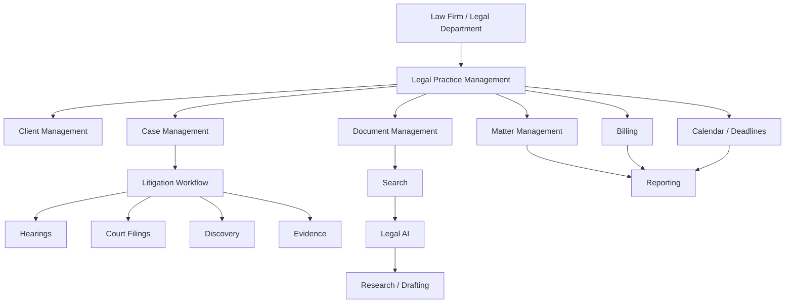
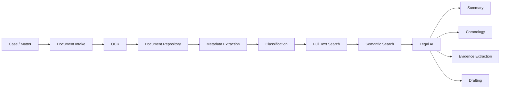
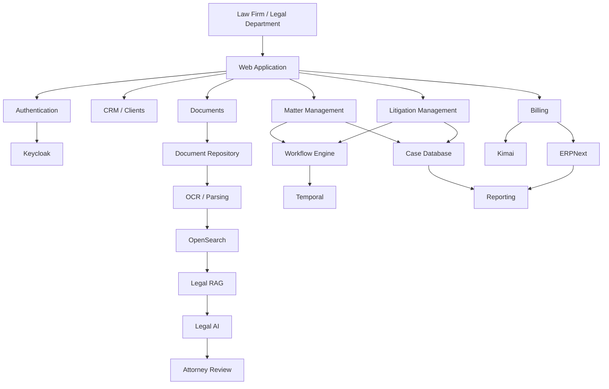

# Awesome-Litigation-Management

# ⚖️ Top Litigation Management Platforms & Open-Source Legal Case Management


> A curated list of **litigation management platforms, legal case management software, law-firm practice management systems, matter management platforms and open-source legal technology**.


Litigation management software helps law firms and legal departments manage the complete lifecycle of legal matters:


* Case and matter management

* Client and contact management

* Litigation timelines

* Court dates and deadlines

* Tasks and workflows

* Documents and evidence

* Legal correspondence

* Time tracking

* Billing and invoicing

* Trust accounting

* Client portals

* Intake

* Conflict checking

* Reporting and analytics

* Legal research

* AI-assisted legal workflows

* E-discovery integrations


This repository focuses primarily on **open-source and self-hostable alternatives**, while keeping commercial platforms such as Litify, SimpleLegal, TyMetrix 360, Legal Tracker, CaseFox, Filevine, Clio Manage, PracticePanther, Smokeball and Actionstep in a separate SaaS/Hosted section.


There is an important distinction between **full litigation-management suites** and individual open-source components. The open-source ecosystem is considerably more fragmented than the commercial legal-tech market, so a self-hosted alternative will often combine case management, document management, workflow, billing, accounting and legal-AI components.


---


## 📑 Table of Contents


* [☁️ SaaS/Hosted Platforms](#️-saashosted-platforms)

* [🌍 Open-Source](#-open-source)

* [⚖️ Open-Source Legal Practice & Case Management](#️-open-source-legal-practice--case-management)

* [📁 Open-Source Matter Management](#-open-source-matter-management)

* [🏛️ Open-Source Court & Case Management](#️-open-source-court--case-management)

* [📄 Open-Source Legal Document Management](#-open-source-legal-document-management)

* [🔍 Open-Source Legal Research & Case Law](#-open-source-legal-research--case-law)

* [🤖 Open-Source Legal AI](#-open-source-legal-ai)

* [⏱️ Open-Source Time Tracking & Billing](#️-open-source-time-tracking--billing)

* [💰 Open-Source Accounting & Invoicing](#-open-source-accounting--invoicing)

* [🔐 Open-Source Identity & Access Management](#-open-source-identity--access-management)

* [⚙️ Open-Source Workflow & Automation](#️-open-source-workflow--automation)

* [🗂️ Open-Source Search & Knowledge Management](#️-open-source-search--knowledge-management)

* [🧩 Commercial Platform → Open-Source Equivalent](#-commercial-platform--open-source-equivalent)

* [🏗️ Litigation Management Architecture](#️-litigation-management-architecture)

* [🔄 Open-Source Legal Case Management Architecture](#-open-source-legal-case-management-architecture)

* [📄 Open-Source Litigation Document Architecture](#-open-source-litigation-document-architecture)

* [🤖 AI-Assisted Litigation Architecture](#-ai-assisted-litigation-architecture)

* [⚖️ Commercial vs Open-Source](#️-commercial-vs-open-source)

* [🚀 Recommended Open-Source Stacks](#-recommended-open-source-stacks)

* [📊 Legal Case Management Comparison](#-legal-case-management-comparison)

* [🎯 Recommended Projects by Use Case](#-recommended-projects-by-use-case)

* [🏢 Building a Litify Alternative](#-building-a-litify-alternative)

* [🏛️ Building an Open-Source Litigation Management Platform](#️-building-an-open-source-litigation-management-platform)

* [🌐 Open-Source Legal Technology Landscape](#-open-source-legal-technology-landscape)

* [🧠 Why Open-Source Litigation Management Matters](#-why-open-source-litigation-management-matters)

* [🤝 Contributing](#-contributing)

* [⚠️ Disclaimer](#️-disclaimer)


---


# ☁️ SaaS/Hosted Platforms


Commercial litigation and legal practice management platforms provide managed case databases, workflows, document management, billing, client portals, integrations and analytics.


| Platform                                                                  | Company         | Primary Focus                       | Key Capabilities                                                           |

| ------------------------------------------------------------------------- | --------------- | ----------------------------------- | -------------------------------------------------------------------------- |

| [Litify](https://www.litify.com/)                                         | Litify          | Legal operations / litigation       | Matter management, intake, workflows, reporting, Salesforce-based platform |

| [SimpleLegal](https://www.simplelegal.com/)                               | SimpleLegal     | Legal spend / matter management     | Legal operations, e-billing, matter management and spend analytics         |

| [TyMetrix 360](https://www.wolterskluwer.com/en/solutions/tymetrix)       | Wolters Kluwer  | Legal spend / matter management     | Legal matter management, e-billing, spend analytics and reporting          |

| [Legal Tracker](https://www.wolterskluwer.com/en/solutions/legal-tracker) | Wolters Kluwer  | Corporate legal management          | Matter management, legal spend, workflows and reporting                    |

| [CaseFox](https://www.casefox.com/)                                       | CaseFox         | Legal practice management           | Case management, time tracking, billing and trust accounting               |

| [Filevine](https://www.filevine.com/)                                     | Filevine        | Litigation / legal operations       | Matter management, documents, workflows, deadlines, intake and legal AI    |

| [Clio Manage](https://www.clio.com/)                                      | Clio            | Practice management                 | Matters, contacts, documents, calendaring, billing and client portal       |

| [PracticePanther](https://www.practicepanther.com/)                       | Paradigm        | Practice management                 | Matters, billing, payments, workflows and client management                |

| [Smokeball](https://www.smokeball.com/)                                   | Smokeball       | Legal practice management           | Matter management, documents, billing, automation and productivity         |

| [Actionstep](https://www.actionstep.com/)                                 | Actionstep      | Practice management                 | Matters, workflows, billing, documents and legal operations                |

| [MyCase](https://www.mycase.com/)                                         | AffiniPay       | Practice management                 | Case management, billing, intake, documents and client communications      |

| [Rocket Matter](https://www.rocketmatter.com/)                            | Rocket Matter   | Practice management                 | Matters, time, billing, documents and reporting                            |

| [CosmoLex](https://www.cosmolex.com/)                                     | CosmoLex        | Legal practice management           | Matter management, billing, trust accounting and accounting                |

| [LEAP](https://www.leap.us/)                                              | LEAP            | Legal practice management           | Matters, documents, billing, legal content and workflows                   |

| [Lawmatics](https://www.lawmatics.com/)                                   | Lawmatics       | Legal CRM / intake                  | Lead intake, CRM, marketing automation and client conversion               |

| [Lawcus](https://lawcus.com/)                                             | Lawcus          | Matter management                   | Matter workflows, CRM, intake, tasks and automation                        |

| [Litera](https://www.litera.com/)                                         | Litera          | Legal document workflow             | Document management, comparison, drafting and collaboration                |

| [Onit](https://www.onit.com/)                                             | Onit            | Enterprise legal operations         | Legal workflow, matter management, contracts and spend                     |

| [Aderant](https://www.aderant.com/)                                       | Aderant         | Enterprise legal management         | Practice management, financial management, billing and matter workflows    |

| [Elite](https://www.thomsonreuters.com/en/products/elite.html)            | Thomson Reuters | Legal practice management           | Financial, billing and practice management                                 |

| [CARET Legal](https://caretlegal.com/)                                    | CARET           | Legal practice management           | Matters, billing, documents, calendaring and reporting                     |

| [TimeSolv](https://www.timesolv.com/)                                     | CARET           | Legal billing / practice management | Time tracking, billing, expenses and project management                    |


---


# 🌍 Open-Source


The open-source legal-tech ecosystem is much more fragmented than the commercial market.


Instead of one project replacing every feature of a platform such as Litify or Clio, a self-hosted system can be assembled from:


```text

                         OPEN-SOURCE LEGAL STACK

                                   │

          ┌────────────────────────┼────────────────────────┐

          │                        │                        │

          ▼                        ▼                        ▼

    Case Management          Documents & Evidence      Legal Research

          │                        │                        │

          ▼                        ▼                        ▼

     Litigious               Paperless-ngx              Case Law

     Kosmos                  OpenKM                     Research

     LawLink                 Mayan EDMS

          │

          ▼

       Workflow

          │

          ▼

      Billing / Time

          │

          ▼

      Accounting

          │

          ▼

       Legal AI

```


A useful distinction is between:


* **Legal-specific open-source applications**

* **Generic case-management platforms**

* **Open-source document management**

* **Open-source legal research**

* **Open-source legal AI**

* **Billing and accounting components**

* **Workflow and automation infrastructure**


---


# ⚖️ Open-Source Legal Practice & Case Management


These projects are the closest open-source equivalents to the **core case/matter-management layer** of commercial legal platforms.


| Project                                                                                                     | Description                                                                                           | License / Status |

| ----------------------------------------------------------------------------------------------------------- | ----------------------------------------------------------------------------------------------------- | ---------------- |

| [Litigious](https://litigious.online/)                                                                      | Modular legal practice management with cases, billing, documents, communications and client workflows | AGPL-3.0         |

| [LawLink](https://github.com/lawflow-boop/LawLink)                                                          | Self-hosted case and practice management for lawyers and small firms                                  | MIT              |

| [Kosmos](https://kosmos.law/)                                                                               | Open-source law-practice management covering matters, intake, tasks, billing and case workflows       | AGPL-3.0         |

| [Legal Case Management System](https://github.com/mlutfy/lcm)                                               | Case management for legal-aid organizations                                                           | Open source      |

| [Matter Management System](https://github.com/worlds-biggest-software-project/093-matter-management-system) | Open-source matter management with billing, trust accounting and client-portal goals                  | Open source      |

| [Court Case Management System](https://github.com/surafel-kindu/Court-Case-Management-System)               | Case registration, assignment, notifications, appeals, search and reporting                           | See repository   |

| [Court Case Management](https://github.com/Sanjays2402/Court-Case-Management)                               | Case, hearing, advocate and legal-workflow management                                                 | MIT              |

| [JuriSync](https://github.com/KH-Coder865/JuriSync)                                                         | Flask-based legal case database and case-management prototype                                         | See repository   |

| [Legal-Case-Mgt-App](https://github.com/Sithija97/Legal-Case-Mgt-App)                                       | Law-firm case data management application                                                             | MIT              |


[Litigious](https://litigious.online/) is one of the more complete current open-source projects in this category, with modular case management, document/AI features, time and billing, client portals, communications and reporting.


[LawLink](https://github.com/lawflow-boop/LawLink) is another explicitly self-hosted legal case/practice management project, released under MIT.


> **Important:** Some smaller GitHub legal case-management projects are prototypes, educational projects or narrowly focused court-management applications rather than production-ready replacements for enterprise products.


---


# 📁 Open-Source Matter Management


Matter management is broader than simply tracking a court case.


A matter can contain:


```text

Matter

 ├── Client

 ├── Opposing Parties

 ├── Attorneys

 ├── Contacts

 ├── Cases

 ├── Documents

 ├── Evidence

 ├── Tasks

 ├── Deadlines

 ├── Hearings

 ├── Communications

 ├── Time Entries

 ├── Expenses

 ├── Invoices

 ├── Notes

 └── Audit Trail

```


| Project                                                                                                     | Focus                                                |

| ----------------------------------------------------------------------------------------------------------- | ---------------------------------------------------- |

| [Litigious](https://litigious.online/)                                                                      | Legal matters and practice management                |

| [Kosmos](https://kosmos.law/)                                                                               | Matters, tasks, contacts, intake and billing         |

| [LawLink](https://github.com/lawflow-boop/LawLink)                                                          | Case and practice management                         |

| [Matter Management System](https://github.com/worlds-biggest-software-project/093-matter-management-system) | Matter management for law firms and legal teams      |

| [Apache OFBiz](https://github.com/apache/ofbiz-framework)                                                   | Generic enterprise workflows and business management |

| [ERPNext](https://github.com/frappe/erpnext)                                                                | ERP, CRM, accounting and workflow                    |

| [OpenProject](https://github.com/opf/openproject)                                                           | Projects, tasks, milestones and workflows            |


Generic open-source project-management systems can provide the workflow foundation for legal matter management, but they generally lack legal-specific concepts such as privilege, conflicts, trust accounting and litigation deadlines.


---


# 🏛️ Open-Source Court & Case Management


Court-oriented systems are useful when the objective is managing the **litigation/court lifecycle** rather than running an entire law firm.


| Project                                                                                       | Capabilities                                                   |

| --------------------------------------------------------------------------------------------- | -------------------------------------------------------------- |

| [Court Case Management System](https://github.com/surafel-kindu/Court-Case-Management-System) | Registration, assignment, notifications, appeals and reporting |

| [Court Case Management](https://github.com/Sanjays2402/Court-Case-Management)                 | Cases, hearings, advocates, notes and outcomes                 |

| [JuriSync](https://github.com/KH-Coder865/JuriSync)                                           | Case search, case management and prioritization                |

| [Legal Case Management System](https://github.com/mlutfy/lcm)                                 | Legal-aid case tracking                                        |

| [Legal-Case-Mgt-App](https://github.com/Sithija97/Legal-Case-Mgt-App)                         | Legal case records and data management                         |


The Surafel Court Case Management System, for example, includes case registration/assignment, notifications, appeals, search and reporting.


---


# 📄 Open-Source Legal Document Management


Litigation generates enormous volumes of documents.


A self-hosted litigation platform can combine a legal case-management system with a dedicated document repository.


| Project                                                                   | Description                                     |

| ------------------------------------------------------------------------- | ----------------------------------------------- |

| [Paperless-ngx](https://github.com/paperless-ngx/paperless-ngx)           | Document management, OCR, tagging and search    |

| [Mayan EDMS](https://github.com/mayan-edms/Mayan-EDMS)                    | Enterprise document management                  |

| [OpenKM](https://github.com/openkm/document-management-system)            | Document management and workflow                |

| [Alfresco Community](https://github.com/Alfresco/alfresco-community-repo) | Enterprise content management                   |

| [Nextcloud](https://github.com/nextcloud/server)                          | Files, sharing and collaboration                |

| [Seafile](https://github.com/haiwen/seafile)                              | File synchronization and document collaboration |

| [Docspell](https://github.com/eikek/docspell)                             | Personal/organizational document management     |

| [Teedy](https://github.com/sismics/docs)                                  | Lightweight document management                 |

| [OpenDocMan](https://github.com/opendocman/opendocman)                    | Web-based document management                   |


A litigation document architecture can therefore separate:


```text

Case Database

     │

     ├── Metadata

     ├── Parties

     ├── Deadlines

     └── Tasks

          │

          ▼

Document Repository

     │

     ├── Pleadings

     ├── Evidence

     ├── Contracts

     ├── Correspondence

     ├── Court Orders

     └── Discovery

```


---


# 🔍 Open-Source Legal Research & Case Law


Legal research can be integrated into a litigation-management system through open datasets, search engines and legal-AI systems.


| Project                                                          | Description                                          |

| ---------------------------------------------------------------- | ---------------------------------------------------- |

| [CourtListener](https://github.com/freelawproject/courtlistener) | Open legal research infrastructure and case-law data |

| [Free Law Project](https://free.law/)                            | Open-source legal information infrastructure         |

| [RECAP](https://free.law/recap/)                                 | Public archive of federal court documents            |

| [eyecite](https://github.com/freelawproject/eyecite)             | Legal citation extraction and parsing                |

| [reporters-db](https://github.com/freelawproject/reporters-db)   | Legal reporter metadata                              |

| [InToto?]                                                        | See project-specific legal applicability             |

| [MOLAO](https://github.com/vul-os/molao)                         | Decentralized case-law corpus and citation graph     |


[CourtListener](https://github.com/freelawproject/courtlistener) and the broader Free Law Project ecosystem are especially relevant for building open legal research and citation infrastructure.


[MOLAO](https://github.com/vul-os/molao) is a newer open-source project focused on a decentralized case-law corpus, citation graph and citator.


---


# 🤖 Open-Source Legal AI


AI can be layered onto litigation-management systems for:


* Matter summarization

* Chronology generation

* Document classification

* Deposition analysis

* Contract analysis

* Evidence extraction

* Legal research

* Citation extraction

* Drafting

* Discovery review

* Privilege classification

* Case similarity

* Legal question answering


| Project                                                             | Description                          |

| ------------------------------------------------------------------- | ------------------------------------ |

| [Judicex](https://github.com/JustVugg/judicex)                      | Evidence-grounded legal AI workspace |

| [eyecite](https://github.com/freelawproject/eyecite)                | Legal citation extraction            |

| [CourtListener](https://github.com/freelawproject/courtlistener)    | Legal research infrastructure        |

| [LegalBench](https://github.com/HazyResearch/legalbench)            | Legal reasoning benchmark            |

| [LegalBERT](https://huggingface.co/nlpaueb/legal-bert-base-uncased) | Legal-domain language model          |

| [Blackstone](https://github.com/ICLRandD/Blackstone)                | Legal NLP pipeline                   |

| [LexNLP](https://github.com/LexPredict/lexpredict-lexnlp)           | Legal text extraction                |

| [spaCy](https://github.com/explosion/spaCy)                         | NLP infrastructure                   |

| [Haystack](https://github.com/deepset-ai/haystack)                  | RAG and document pipelines           |

| [LlamaIndex](https://github.com/run-llama/llama_index)              | Retrieval and document AI            |


[Judicex](https://github.com/JustVugg/judicex) is explicitly positioned as an open-source legal AI workspace for evidence-grounded drafting and matter analysis, with local/private deployment and Apache-2.0 licensing.


---


# ⏱️ Open-Source Time Tracking & Billing


Time and billing are core components of most commercial legal practice-management platforms.


| Project                                                      | Description                                   |

| ------------------------------------------------------------ | --------------------------------------------- |

| [Kimai](https://github.com/kimai/kimai)                      | Open-source time tracking                     |

| [InvoiceShelf](https://github.com/InvoiceShelf/InvoiceShelf) | Invoicing and billing                         |

| [ERPNext](https://github.com/frappe/erpnext)                 | Accounting, invoices and payments             |

| [Odoo Community](https://github.com/odoo/odoo)               | Accounting, invoicing and business management |

| [Kill Bill](https://github.com/killbill/killbill)            | Billing and payment platform                  |

| [SolidInvoice](https://github.com/solidinvoice/solidinvoice) | Open-source invoicing                         |


[Kimai](https://github.com/kimai/kimai) is particularly useful as a standalone time-tracking component for legal teams, including timesheets, invoices and reporting.


A litigation platform can connect:


```text

Matter

  │

  ▼

Time Entry

  │

  ├── Attorney

  ├── Date

  ├── Duration

  ├── Activity

  └── Billing Rate

  │

  ▼

Invoice

  │

  ▼

Payment

```


---


# 💰 Open-Source Accounting & Invoicing


| Project                                                      | Primary Role     |

| ------------------------------------------------------------ | ---------------- |

| [ERPNext](https://github.com/frappe/erpnext)                 | Accounting / ERP |

| [Odoo Community](https://github.com/odoo/odoo)               | Accounting / ERP |

| [InvoiceShelf](https://github.com/InvoiceShelf/InvoiceShelf) | Invoicing        |

| [Kimai](https://github.com/kimai/kimai)                      | Time tracking    |

| [Kill Bill](https://github.com/killbill/killbill)            | Billing          |

| [SolidInvoice](https://github.com/solidinvoice/solidinvoice) | Invoicing        |


For legal-specific deployments, the accounting layer should also handle:


```text

Client Funds

Trust Accounts

Operating Accounts

Matter Expenses

Attorney Time

Disbursements

Invoices

Payments

Refunds

Reconciliation

```


---


# 🔐 Open-Source Identity & Access Management


Legal data is highly sensitive, making access control a fundamental part of a self-hosted litigation platform.


| Project                                                       | Description                      |

| ------------------------------------------------------------- | -------------------------------- |

| [Keycloak](https://github.com/keycloak/keycloak)              | Identity and access management   |

| [Authentik](https://github.com/goauthentik/authentik)         | Identity provider                |

| [Authelia](https://github.com/authelia/authelia)              | Authentication and authorization |

| [Open Policy Agent](https://github.com/open-policy-agent/opa) | Policy engine                    |

| [Casbin](https://github.com/casbin/casbin)                    | Authorization framework          |


A legal application can implement:


```text

Firm

 ├── Partners

 ├── Attorneys

 ├── Paralegals

 ├── Legal Assistants

 ├── Billing Staff

 ├── Clients

 └── External Counsel

```


with matter-level access controls.


---


# ⚙️ Open-Source Workflow & Automation


Litigation involves complex workflows and deadlines.


| Project                                                      | Description                    |

| ------------------------------------------------------------ | ------------------------------ |

| [Temporal](https://github.com/temporalio/temporal)           | Durable workflow orchestration |

| [Camunda](https://github.com/camunda/camunda)                | BPMN workflow automation       |

| [n8n](https://github.com/n8n-io/n8n)                         | Workflow automation            |

| [Apache Airflow](https://github.com/apache/airflow)          | Data/workflow orchestration    |

| [Node-RED](https://github.com/node-red/node-red)             | Event-driven automation        |

| [Activepieces](https://github.com/activepieces/activepieces) | Open-source automation         |


Example:


```text

New Matter

    │

    ▼

Conflict Check

    │

    ▼

Client Intake

    │

    ▼

Matter Created

    │

    ▼

Assign Attorney

    │

    ▼

Create Deadlines

    │

    ▼

Create Tasks

    │

    ▼

Document Collection

    │

    ▼

Court Filing

    │

    ▼

Hearing

    │

    ▼

Matter Resolution

```


---


# 🗂️ Open-Source Search & Knowledge Management


Legal teams need fast search across:


* Matters

* Clients

* Documents

* Emails

* Court filings

* Evidence

* Notes

* Case law

* Contracts


| Project                                                        | Description          |

| -------------------------------------------------------------- | -------------------- |

| [OpenSearch](https://github.com/opensearch-project/OpenSearch) | Search and analytics |

| [Elasticsearch](https://github.com/elastic/elasticsearch)      | Search engine        |

| [Apache Solr](https://github.com/apache/solr)                  | Enterprise search    |

| [Typesense](https://github.com/typesense/typesense)            | Search engine        |

| [Meilisearch](https://github.com/meilisearch/meilisearch)      | Fast search          |

| [Qdrant](https://github.com/qdrant/qdrant)                     | Vector database      |

| [Weaviate](https://github.com/weaviate/weaviate)               | Vector database      |

| [Milvus](https://github.com/milvus-io/milvus)                  | Vector database      |


A modern legal search system can combine:


```text

Keyword Search

      +

Metadata Filtering

      +

Semantic Search

      +

Citation Search

      +

RAG

      =

Legal Knowledge Search

```


---


# 🧩 Commercial Platform → Open-Source Equivalent


| Commercial Platform             | Open-Source Equivalent / Building Blocks                            |

| ------------------------------- | ------------------------------------------------------------------- |

| **Litify**                      | Litigious / Kosmos + Paperless-ngx + Keycloak + Temporal + legal AI |

| **SimpleLegal**                 | Matter management + ERPNext + Kimai + workflow engine               |

| **TyMetrix 360**                | Matter management + ERPNext + Kimai + OpenSearch                    |

| **Legal Tracker**               | Matter management + workflow + ERPNext + OpenSearch                 |

| **CaseFox**                     | LawLink / Kosmos + Kimai + InvoiceShelf                             |

| **Filevine**                    | Litigious / Kosmos + document management + Temporal + legal AI      |

| **Clio Manage**                 | Kosmos / Litigious + Paperless-ngx + Kimai + ERPNext                |

| **PracticePanther**             | Kosmos + Kimai + InvoiceShelf + Keycloak                            |

| **Smokeball**                   | Litigious + Paperless-ngx + Temporal + document automation          |

| **Actionstep**                  | Kosmos + Temporal + ERPNext + OpenSearch                            |

| **MyCase**                      | Litigious + Kosmos + document management                            |

| **Rocket Matter**               | Kosmos + Kimai + InvoiceShelf                                       |

| **CosmoLex**                    | Kosmos + ERPNext + Kimai                                            |

| **LEAP**                        | Litigious + document management + legal research                    |

| **Enterprise Legal Management** | Matter Management + Workflow + ERP + Search                         |

| **Legal Spend Management**      | Matter Management + Kimai + ERPNext + analytics                     |

| **Litigation Management**       | Case Management + Documents + Workflow + Legal AI                   |

| **Legal Research Platform**     | CourtListener + eyecite + OpenSearch + Legal AI                     |


---


# 🏗️ Litigation Management Architecture


A conventional litigation-management platform can be represented as:





---


# 🔄 Open-Source Legal Case Management Architecture


```text

                         LAW FIRM

                            │

                            ▼

                     WEB / MOBILE UI

                            │

                            ▼

                      API GATEWAY

                            │

              ┌─────────────┼─────────────┐

              │             │             │

              ▼             ▼             ▼

           Matters        Cases        Clients

              │             │             │

              └─────────────┼─────────────┘

                            ▼

                       Case Engine

                            │

          ┌─────────────────┼─────────────────┐

          ▼                 ▼                 ▼

      Documents          Tasks            Deadlines

          │                 │                 │

          ▼                 ▼                 ▼

     Paperless-ngx      Temporal          Calendar

          │

          ▼

        Search

          │

          ▼

      OpenSearch

          │

          ▼

       Legal AI

```


---


# 📄 Open-Source Litigation Document Architecture





Potential stack:


```text

Paperless-ngx

      +

OCRmyPDF

      +

Tesseract

      +

OpenSearch

      +

Qdrant

      +

LlamaIndex / Haystack

      +

Local LLM

```


---


# 🤖 AI-Assisted Litigation Architecture


Modern litigation management can add an AI layer on top of the matter database.


```text

                         MATTER

                           │

                           ▼

                    Matter Documents

                           │

            ┌──────────────┼──────────────┐

            ▼              ▼              ▼

         Pleadings       Emails         Evidence

            │              │              │

            └──────────────┼──────────────┘

                           ▼

                      OCR / Parsing

                           │

                           ▼

                     Legal Chunking

                           │

                    ┌──────┴──────┐

                    ▼             ▼

               Keyword Index   Vector DB

                    │             │

                    └──────┬──────┘

                           ▼

                     Legal RAG

                           │

                           ▼

                       LLM / VLM

                           │

          ┌────────────────┼────────────────┐

          ▼                ▼                ▼

      Chronology       Case Summary      Drafting

          │                │                │

          └────────────────┼────────────────┘

                           ▼

                      Attorney Review

```


---


# 🧠 Litigation Timeline Engine


One particularly valuable feature of litigation software is automated chronology generation.


```text

Documents

   │

   ▼

Date Extraction

   │

   ▼

Event Extraction

   │

   ▼

Entity Resolution

   │

   ▼

Chronology

   │

   ├── Filing

   ├── Hearing

   ├── Order

   ├── Communication

   ├── Discovery Event

   ├── Deadline

   └── Settlement

```


Example:


```text

2026-01-04 ─ Complaint filed

2026-01-19 ─ Defendant served

2026-02-02 ─ Answer filed

2026-03-10 ─ Discovery begins

2026-04-15 ─ Deposition

2026-05-01 ─ Motion filed

2026-05-20 ─ Hearing

```


---


# 🔐 Legal Data Security Architecture


Legal software must treat confidentiality as a first-class architectural concern.


```text

                     User

                      │

                      ▼

                Identity Provider

                   Keycloak

                      │

                      ▼

                Authorization

                      │

                      ▼

                  Matter ACL

                      │

             ┌────────┴────────┐

             ▼                 ▼

        Case Database      Documents

             │                 │

             ▼                 ▼

        PostgreSQL        Encrypted Storage

             │                 │

             └────────┬────────┘

                      ▼

                  Audit Log

```


Important controls include:


* Matter-level authorization

* Role-based access control

* Client-level permissions

* Ethical-wall / information-barrier support

* Encryption at rest

* Encryption in transit

* Audit logs

* Document versioning

* Retention policies

* Secure backups

* Access monitoring

* MFA

* SSO

* Data residency controls


---


# ⚖️ Commercial vs Open-Source


| Capability            | Commercial Legal Platform | Open-Source Stack       |

| --------------------- | ------------------------- | ----------------------- |

| Matter Management     | ✅                         | ✅                       |

| Case Management       | ✅                         | ✅                       |

| Client Management     | ✅                         | ✅                       |

| Document Management   | ✅                         | ✅                       |

| Calendar              | ✅                         | ✅                       |

| Tasks                 | ✅                         | ✅                       |

| Billing               | ✅                         | ✅                       |

| Time Tracking         | ✅                         | ✅                       |

| Trust Accounting      | Often                     | Requires implementation |

| Legal Research        | Often integrated          | Assemble separately     |

| Legal AI              | Increasingly integrated   | Build / integrate       |

| Client Portal         | ✅                         | Build / integrate       |

| Workflow Automation   | ✅                         | ✅                       |

| Reporting             | ✅                         | ✅                       |

| Search                | ✅                         | ✅                       |

| Self Hosting          | Usually limited           | ✅                       |

| Source Code           | ❌                         | ✅                       |

| Data Ownership        | Vendor-dependent          | Full control            |

| Customization         | Medium / High             | Very High               |

| Vendor Lock-in        | Higher                    | Lower                   |

| Implementation Effort | Lower                     | Higher                  |

| Infrastructure        | Managed                   | Self-managed            |

| Compliance Tooling    | Usually integrated        | Build / integrate       |

| Enterprise Support    | ✅                         | Community / vendors     |

| Air-Gapped Deployment | Limited                   | ✅                       |


---


# 📊 Legal Case Management Comparison


| Project                      |   Legal-Specific  | Matters | Cases | Documents | Billing | Workflow |  Self-Host  |

| ---------------------------- | :---------------: | :-----: | :---: | :-------: | :-----: | :------: | :---------: |

| Litigious                    |         ✅         |    ✅    |   ✅   |     ✅     |    ✅    |     ✅    |      ✅      |

| Kosmos                       |         ✅         |    ✅    |   ✅   |     ⚠️    |    ✅    |     ✅    |      ✅      |

| LawLink                      |         ✅         |    ✅    |   ✅   |     ✅     |    ⚠️   |    ⚠️    |      ✅      |

| LCM                          |         ✅         |    ✅    |   ✅   |     ⚠️    |    ❌    |    ⚠️    |      ✅      |

| Matter Management System     |         ✅         |    ✅    |   ✅   |     ⚠️    |    ✅    |     ✅    |      ✅      |

| Court Case Management System |      ⚖️ Court     |    ✅    |   ✅   |     ⚠️    |    ❌    |     ✅    |      ✅      |

| JuriSync                     |      ⚖️ Legal     |    ✅    |   ✅   |     ⚠️    |    ❌    |    ⚠️    |   See repo  |

| Paperless-ngx                |         ❌         |    ⚠️   |   ⚠️  |     ✅     |    ❌    |    ⚠️    |      ✅      |

| Mayan EDMS                   |         ❌         |    ⚠️   |   ⚠️  |     ✅     |    ❌    |     ✅    |      ✅      |

| OpenKM                       |         ❌         |    ⚠️   |   ⚠️  |     ✅     |    ❌    |     ✅    |      ✅      |

| ERPNext                      |         ❌         |    ⚠️   |   ⚠️  |     ⚠️    |    ✅    |     ✅    |      ✅      |

| Kimai                        |         ❌         |    ❌    |   ❌   |     ❌     |    ✅    |    ⚠️    |      ✅      |

| CourtListener                | ⚖️ Legal Research |    ❌    |   ⚠️  |     ⚠️    |    ❌    |     ❌    | Open source |


**Legend:**

`✅` = substantial support

`⚠️` = possible through customization/integration

`❌` = not a primary capability


---


# 🎯 Recommended Projects by Use Case


| Use Case                              | Recommended Starting Point                                      |

| ------------------------------------- | --------------------------------------------------------------- |

| Open-source legal practice management | **Litigious**                                                   |

| Small law firm                        | **Kosmos**                                                      |

| Self-hosted legal case management     | **LawLink**                                                     |

| Legal-aid case management             | **LCM**                                                         |

| Court case management                 | **Court Case Management System**                                |

| Matter management                     | **Matter Management System / Kosmos**                           |

| Document management                   | **Paperless-ngx / Mayan EDMS**                                  |

| Legal research                        | **CourtListener / Free Law Project**                            |

| Legal citation extraction             | **eyecite**                                                     |

| Legal AI workspace                    | **Judicex**                                                     |

| Legal NLP                             | **LexNLP / Blackstone / LegalBERT**                             |

| Time tracking                         | **Kimai**                                                       |

| Invoicing                             | **InvoiceShelf**                                                |

| Accounting                            | **ERPNext / Odoo Community**                                    |

| Workflow automation                   | **Temporal / Camunda / n8n**                                    |

| Authentication                        | **Keycloak / Authentik**                                        |

| Search                                | **OpenSearch / Elasticsearch**                                  |

| Semantic legal search                 | **Qdrant / Weaviate**                                           |

| Full self-hosted stack                | **Litigious + Paperless-ngx + OpenSearch + Keycloak + ERPNext** |


---


# 🏢 Building a Litify Alternative


A Litify-like architecture can be assembled from open-source components.


```text

                         LAW FIRM

                            │

                            ▼

                     LEGAL APPLICATION

                            │

                            ▼

                       API GATEWAY

                            │

              ┌─────────────┼─────────────┐

              ▼             ▼             ▼

           Intake        Matters        Cases

              │             │             │

              └─────────────┼─────────────┘

                            ▼

                      Litigious/Kosmos

                            │

          ┌─────────────────┼─────────────────┐

          ▼                 ▼                 ▼

       Documents         Workflow          Billing

          │                 │                 │

          ▼                 ▼                 ▼

    Paperless-ngx       Temporal           ERPNext

          │

          ▼

      OpenSearch

          │

          ▼

       Legal AI

```


### Suggested Components


```text

Case / Matter Management → Litigious / Kosmos

Documents                 → Paperless-ngx / Mayan EDMS

Search                    → OpenSearch

Vector Search             → Qdrant

Authentication            → Keycloak

Workflow                  → Temporal

Time Tracking             → Kimai

Accounting                → ERPNext

Legal Research            → CourtListener

Legal Citations           → eyecite

Legal AI                  → Judicex / local LLM

Database                  → PostgreSQL

Object Storage            → MinIO

```


---


# 🏛️ Building an Open-Source Litigation Management Platform


A complete open-source platform could be structured as:





---


# 🧱 Litigation Management Layers


```text

┌─────────────────────────────────────────────────┐

│              LAW FIRM APPLICATION               │

│ Matters • Cases • Clients • Attorneys           │

└────────────────────────┬────────────────────────┘

                         │

┌────────────────────────▼────────────────────────┐

│             LITIGATION WORKFLOW                 │

│ Hearings • Deadlines • Filings • Discovery      │

└────────────────────────┬────────────────────────┘

                         │

┌────────────────────────▼────────────────────────┐

│             DOCUMENT MANAGEMENT                 │

│ Pleadings • Evidence • Emails • Orders          │

└────────────────────────┬────────────────────────┘

                         │

┌────────────────────────▼────────────────────────┐

│                 LEGAL SEARCH                    │

│ Full Text • Semantic • Citation • RAG           │

└────────────────────────┬────────────────────────┘

                         │

┌────────────────────────▼────────────────────────┐

│                   LEGAL AI                      │

│ Summarization • Chronology • Drafting           │

└────────────────────────┬────────────────────────┘

                         │

┌────────────────────────▼────────────────────────┐

│             BILLING & ACCOUNTING                │

│ Time • Expenses • Invoices • Trust              │

└─────────────────────────────────────────────────┘

```


---


# 🔥 Recommended Open-Source Legal Stack


A strong general-purpose self-hosted architecture could be:


```text

                        LAW FIRM

                           │

                           ▼

                     LITIGIOUS

                           │

          ┌────────────────┼────────────────┐

          │                │                │

          ▼                ▼                ▼

       Matters          Documents        Billing

          │                │                │

          │                ▼                ▼

          │          Paperless-ngx       ERPNext

          │                │

          │                ▼

          │           OpenSearch

          │                │

          └────────────────┼────────────────┐

                           ▼                │

                       Legal RAG            │

                           │                │

                           ▼                │

                        Judicex              │

                           │                │

                           ▼                │

                    Attorney Review         │

                                            │

                    Kimai ◄─────────────────┘

```


---


# 🌐 Open-Source Legal Technology Landscape


```mermaid

mindmap

  root((Legal Technology))

    Litigation Management

      Litigious

      Kosmos

      LawLink

      LCM

      Matter Management System

    Court Management

      Court Case Management

      JuriSync

      Legal Case Management

    Documents

      Paperless-ngx

      Mayan EDMS

      OpenKM

      Alfresco

      Nextcloud

      Docspell

    Legal Research

      CourtListener

      Free Law Project

      RECAP

      eyecite

      reporters-db

      MOLAO

    Legal AI

      Judicex

      LegalBERT

      LegalBench

      Blackstone

      LexNLP

    Billing

      Kimai

      InvoiceShelf

      ERPNext

      Odoo

      Kill Bill

    Workflow

      Temporal

      Camunda

      n8n

      Node-RED

    Identity

      Keycloak

      Authentik

      Authelia

      OPA

    Search

      OpenSearch

      Elasticsearch

      Solr

      Qdrant

      Weaviate

    Infrastructure

      PostgreSQL

      MinIO

      Kafka

      Kubernetes

      Docker

```


---


# 🧠 Why Open-Source Litigation Management Matters


Commercial legal platforms provide a highly integrated experience, but firms and legal departments may have reasons to control the underlying software and data.


Open-source infrastructure can provide:


* Self-hosting

* Data ownership

* Source-code visibility

* Custom workflows

* Custom matter schemas

* Private AI deployment

* Air-gapped operation

* Integration flexibility

* Reduced vendor lock-in

* Long-term archival control

* Custom legal-research pipelines


The architectural difference can be summarized as:


```text

                  COMMERCIAL PLATFORM


             ┌───────────────────────┐

             │   Legal SaaS Vendor   │

             │                       │

             │ CRM                   │

             │ Matters               │

             │ Documents             │

             │ Billing               │

             │ Workflow              │

             │ AI                    │

             └───────────┬───────────┘

                         │

                         ▼

                    Law Firm


                  OPEN-SOURCE STACK


                      Law Firm

                         │

                         ▼

                  Own Application

                         │

        ┌────────────────┼────────────────┐

        ▼                ▼                ▼

    Case System      Documents          Billing

        │                │                │

        ▼                ▼                ▼

    Litigious        Paperless         ERPNext

        │                │                │

        └────────────────┼────────────────┘

                         ▼

                    Legal AI

```


The main advantage is therefore not simply "free software".


It is the ability to **compose, inspect, modify and self-host the software stack that manages highly sensitive legal information**.


---


# 🧩 Building a Full Clio / Filevine Alternative


A realistic open-source architecture would combine several specialized systems:


```text

Clio / Filevine-like Platform

            │

            ├── Practice Management

            │       └── Litigious / Kosmos

            │

            ├── Litigation

            │       └── Custom Case Engine

            │

            ├── Documents

            │       └── Paperless-ngx / Mayan EDMS

            │

            ├── Search

            │       └── OpenSearch

            │

            ├── Legal Research

            │       └── CourtListener

            │

            ├── Legal AI

            │       └── Judicex / Local LLM

            │

            ├── Time

            │       └── Kimai

            │

            ├── Accounting

            │       └── ERPNext

            │

            ├── Workflow

            │       └── Temporal

            │

            └── Identity

                    └── Keycloak

```


---


# 🧪 Minimal Self-Hosted Litigation Platform


For an initial prototype:


```text

Litigious / Kosmos

        +

PostgreSQL

        +

Paperless-ngx

        +

Keycloak

        +

OpenSearch

```


Then add:


```text

Kimai

   +

ERPNext

   +

Temporal

   +

Qdrant

   +

Judicex / Local LLM

   +

CourtListener

```


This produces a progressively richer architecture:


```text

Phase 1

Case Management

      ↓

Phase 2

Documents + Search

      ↓

Phase 3

Billing + Accounting

      ↓

Phase 4

Workflow Automation

      ↓

Phase 5

Legal Research

      ↓

Phase 6

Legal AI / RAG

```


---


# 🔐 Legal AI + Human-in-the-Loop


AI should generally be treated as an assistant rather than an autonomous decision-maker in litigation workflows.


```text

             Legal Documents

                    │

                    ▼

                Legal AI

                    │

          ┌─────────┼─────────┐

          ▼         ▼         ▼

       Summary   Extraction  Draft

          │         │         │

          └─────────┼─────────┘

                    ▼

             Attorney Review

                    │

              ┌─────┴─────┐

              ▼           ▼

           Approve      Reject

              │           │

              ▼           ▼

           Matter       Revision

            File

```


This architecture helps preserve a clear boundary between:


```text

AI Assistance

      ≠

Legal Advice

      ≠

Attorney Judgment

```


---


# 📈 Litigation Analytics


An open-source analytics layer can combine:


```text

Matter Data

    +

Time Data

    +

Billing Data

    +

Case Outcomes

    +

Deadline Data

    +

Document Data

    +

Research Data

```


to produce:


* Matter workload

* Attorney utilization

* Case duration

* Litigation pipeline

* Budget vs actual

* Legal spend

* Deadline compliance

* Document volume

* Case chronology

* Outcome statistics

* Client-level analytics


Possible stack:


```text

PostgreSQL

    +

Apache Superset

    +

Metabase

    +

OpenSearch Dashboards

```


---


# 🤝 Contributing


Contributions are welcome!


Please consider adding:


* Open-source legal practice-management systems

* Litigation-management platforms

* Matter-management software

* Court-management systems

* Legal document-management systems

* Legal research projects

* Case-law databases

* Legal NLP models

* Legal AI systems

* Citation extraction tools

* Time-tracking software

* Legal billing systems

* Trust-accounting software

* Workflow engines

* Legal search engines

* E-discovery tools

* Evidence-management systems

* Legal data APIs

* Open legal datasets

* Self-hosted legal infrastructure


When adding a project, please clearly distinguish between:


* **Fully open-source**

* **Open-core**

* **Source available**

* **Hosted open-source**

* **Prototype / experimental**

* **Generic infrastructure**

* **Legal-specific software**


Do not classify a proprietary commercial platform as open source merely because it exposes an API or integrates open-source components.


---


# ⚠️ Disclaimer


This repository is an independent technical curation and is **not affiliated with or endorsed by any company or project listed here**.


Legal software is highly jurisdiction-dependent.


Open-source software can provide the technical infrastructure for:


* Case management

* Matter management

* Document management

* Billing

* Workflow

* Search

* Legal research

* Legal AI


but software alone does not provide:


* Legal advice

* Attorney-client relationships

* Professional legal services

* Bar admission

* Court representation

* Regulatory compliance

* Ethical compliance

* Data-protection compliance

* Attorney supervision

* Professional responsibility


AI-generated legal content should be reviewed by qualified legal professionals before being relied upon.


Licensing also varies between projects. Always verify the current software license, dependencies, data licenses and commercial-use restrictions before deployment.


---


## ⭐ Star This Repository


If you are interested in:


* Litigation Management

* Legal Case Management

* Matter Management

* Legal Practice Management

* Legal Operations

* Legal AI

* Legal Research

* E-Discovery

* Legal Documents

* Legal Billing

* Open-Source Legal Technology

* Self-Hosted Legal Software


consider giving this repository a ⭐ **Star** and contributing new projects.


---


**Last updated: September 2026**
